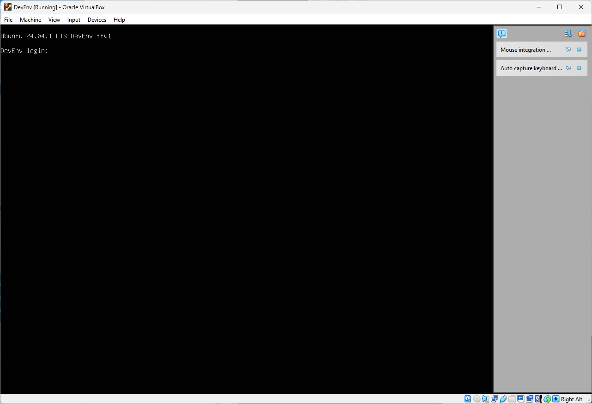
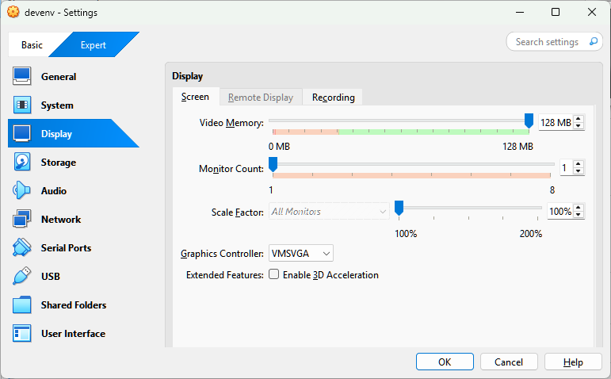

# Lance Blackwood's Development Environment  

This procedure will create a development environment suitable to run in a virtual machine.
The environment will focus on an environment using Microsoft Visual Studio Code, a free integrated development environment running on Ubuntu Linux.
There is also an eye on memory footprint, so older tools such as Midnight Commander, Window Maker, and XTerm are used.
Database work will be done with Oracle MySQL Community, and Perl will round out the LAMP stack.
While sonme of these tools are crude, they are available on almost every production server from cloud to telecommunications so learning them is a good idea.
Combining these tools makes for a development environment that matches the production environment.

| Application | Use | Link |
|-------------|-----|------|
| VirtualBox | virtual machine | https://www.virtualbox.org/ |
| Ubuntu | operating system | https://ubuntu.com/ |
| Window Maker | window manager | https://www.windowmaker.org/ |
| XTerm | terminal emulator| https://invisible-island.net/xterm/ |
| Midnight Commander | file manager | https://midnight-commander.org/ |
| Vim | text editor| https://www.vim.org/ |
| MySQL | database | https://www.mysql.com/ |
| Perl | scripting | https://www.perl.org/ |

## Install Oracle VirtualBox

This is the virtual development that will host the virtual machine. The initial steps will be to download the latest install package for your host operating system. 
This example is using Windows 11 as the host and will be installing Ubuntu as the guest operating system.  

Download the latest version from the [VirtualBox downloads](https://www.virtualbox.org/wiki/Downloads) page, which is 7.1.4 at the time of this writing, for your host operating system.
Once downloaded double click the executable to launch the installer, the default choices will leave a sane VirtualBox install.

## Install Ubuntu Server LTS

The guest operating system is Ubuntu Server LTS, or long-term support. Versions designed with long support in mind are easier to develop for as programming interfaces are changed much less over time that regular versions. The virtual machine will need a disk image to boot from, [Ubuntu Server downloads](https://ubuntu.com/download/server), get the 24.04.1 LTS version.

## Create Virtual Machine in VirtualBox
Click on the blue New button to create a new virtual machine.
  
  
Set the name field to the preferred hostname, this example used "DevEnv", the the operating system type to Linux, subtype to Ubuntu, and the Version to Ubuntu (64-bit). Use the ISO Image field chooser to select the disk image downloaded earlier.
  

Set the number of CPU and amount of memory, this case is 4 CPU and 8192 megabytes of memory. 
  

Finally set the location of the virtual disk and size which can be left at the defaults for a 25 gigabyte disk. Check the Pre-allocate Full Size checkbox to speed up disk operations.


## Initial Virtual Machine Boot
You will be presented with a boot screen after the virtual machine is created. Choose all the defaults during install. When presented with the choice for machine name this documents chose "DevEnv". Set a username and password, when presented with the choice, and remember the choices.
Choose Machine/ACPI Shutdown to shut the virtual machine down in order to do more virtual machine configuration.


## Configure Video RAM
From the main VirtualBox screen, make sure the DevEnv is selected and click the orange settings button. 128 megabytes of video RAM ensures the Linux virtual machine runs smoothly.


## Install Window Maker, Xterm and WDM
Ubuntu server does not have a graphical user interface (GUI) so we need to install one. 
```
sudo apt install wmaker xterm wdm
```


